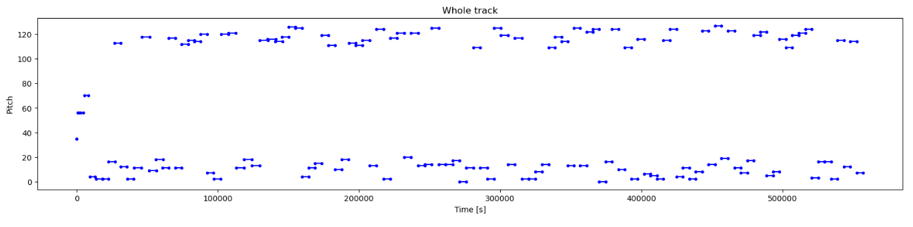

### Hi there 👋

### Languages

 

 

<!--  -->
 <!--START_SECTION:waka-->

 <h1>Some of my Projects</h1>
 <h3>Artificial Intelligence</h3>
 <ul>
  <li><a href="https://github.com/braden0m/music-making" target="_blank" rel="noopener noreferrer">AI Music Generation Project </a>: </li> 
 </ul>

  <h3>Games</h3>
 <ul>   
  <li><a href="https://braden0m.itch.io/save-mi" target="_blank" rel="noopener noreferrer">Save Mi VR Game</a>:  </li>
  <li><a href="https://braden0m.itch.io/marble-madness-remake" target="_blank" rel="noopener noreferrer">Marble Madness Remake</a>: </li>
 </ul>
 
<!--END_SECTION:waka-->
<!--
**braden0m/braden0m** is a ✨ _special_ ✨ repository because its `README.md` (this file) appears on your GitHub profile.

Here are some ideas to get you started:

- 🔭 I’m currently working on ...
- 🌱 I’m currently learning ...
- 👯 I’m looking to collaborate on ...
- 🤔 I’m looking for help with ...
- 💬 Ask me about ...
- 📫 How to reach me: ...
- 😄 Pronouns: ...
- ⚡ Fun fact: ...
-->
